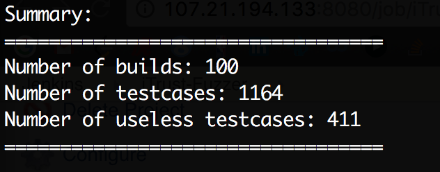

# Milestone 2 - Test + Analysis Milestone #


| Member                 | Contribution |
| :---                   | :---         |
<<<<<<< HEAD
| Dian Ding(dding3)      | iTrust Jobs setup, Testing Component, Useless test detector |
| Kai Lu(klu2)           | Commit Fuzzer, Code Fuzzer |
| Xiangqing Ding(xding3) | Analysis and build failure |
| Fuxing Luan(fluan)     | Analysis and build failure |
=======
| Dian Ding(dding3)      |  |
| Kai Lu(klu2)           |  |
| Xiangqing Ding(xding3) |  |
| Fuxing Luan(fluan)     |  |
>>>>>>> 3340d31fdf7bb9314d2ab72ad8653dc02ee1fb8a


## iTrust ##

### Setup and Run ###
1. Setup Jenkins and Jobs

  ```
    Go to Jenkins directory
    Run <ansible-playbook playbook.yml -i inventory>
    Open Jenkins to verify code coverage and test results
  ```

2. Code Fuzzer

  ```
    Go to test-fuzzer directory
    Run <mvn clean && mvn package>
    The executable jar file locates at target/TestFuzzer-jar-with-dependencies.jar
  ```

3. Fuzzing operation

  ```
    Go to Fuzzer directory
    Run <ansible-playbook playbook.yml -i inventory>  
  ```

4. Useless test detector
  
  ```
    Log on the Jenkins server
    Navigate to directory "/src/www/script"
    Run "sudo python detector.py"
    The Useless test detector report locates at /src/www/script/report.txt
    PS: You don't have to do this step, the useless test detect is automated in the fuzzing operation, you can check the report.txt file directly
  ```
  
### Results ###
* Test results

* Coverage

* Useless test detect



## Demo ##

| Task Description       | Screencast |
| :---                   | :---         |
| Test suites, coverage, and test results      | [Link](https://youtu.be/HnLdSuTxcw4) |
| Commit fuzzer, Uselesss test detector        | [Link](https://youtu.be/K9vi80O5OqA) |


## Reference ##
